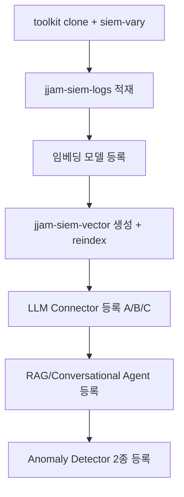

# jjam-siem-dojo

"보안관제 AI에게 짬때리기" 강의(Session 1~2, 3h×2) 수강생용 핸즈온 실습 레포입니다. 강사가 검증한 OpenSearch AI SIEM 파이프라인(로그 인제스트 → 벡터 검색 → LLM Agent → 이상탐지)을 단일 서버에서 그대로 재현합니다.

## 무엇을 실습하나요

100,000건의 SIEM 로그(`darkknight25/Advanced_SIEM_Dataset`)를 OpenSearch에 적재하고, ML Commons로 임베딩/LLM을 연결해 시맨틱 검색과 AI Agent 대화를 실습한 뒤, RCF 기반 이상탐지까지 한 번에 구성합니다.



## 사전 요구사항

- Docker + Docker Compose V2
- Python 3.10+, [Poetry](https://python-poetry.org/docs/#installation)
- `jq`, `curl`
- LLM 옵션 중 하나 선택 (아래 참고)

## LLM 옵션 3종

| 옵션 | 방식 | 최소 RAM | 문서 |
|---|---|---|---|
| A | OpenAI API (기본 권장) | 8GB | [docs/OPTION-A-OPENAI.md](docs/OPTION-A-OPENAI.md) |
| B | Ollama 로컬 | 16GB+ | [docs/OPTION-B-OLLAMA.md](docs/OPTION-B-OLLAMA.md) |
| C | Claude API (강사 검증용) | 8GB | [docs/OPTION-C-CLAUDE.md](docs/OPTION-C-CLAUDE.md) |

## 빠른 시작

[docs/QUICKSTART.md](docs/QUICKSTART.md) 참고.

```bash
git clone <this-repo-url>
cd jjam-siem-dojo
cp .env.example .env
bash scripts/00-setup.sh
```

## 레포 구조

```
jjam-siem-dojo/
├── docker-compose.yml
├── .env.example
├── scripts/
│   ├── 00-setup.sh
│   ├── 01-wait-for-opensearch.sh
│   ├── 02-generate-and-ingest.sh
│   ├── 03-register-embedding-model.sh
│   ├── 04-create-vector-index.sh
│   ├── 05-register-llm-connector.sh
│   ├── 06-register-agents.sh
│   ├── 07-create-detectors.sh
│   └── 99-teardown.sh
├── requests/
│   ├── mappings/
│   ├── pipelines/
│   ├── detectors/
│   ├── connectors/
│   └── agents/
└── docs/
    ├── QUICKSTART.md
    ├── OPTION-A-OPENAI.md
    ├── OPTION-B-OLLAMA.md
    ├── OPTION-C-CLAUDE.md
    └── TROUBLESHOOTING.md
```

## 인덱스 구조

| 인덱스 | 용도 |
|---|---|
| `jjam-siem-logs` | 원본 SIEM 로그 (100k, `advanced_siem` 데이터셋) |
| `jjam-siem-vector` | 시맨틱 검색용 벡터 인덱스 (`description_embedding`) |

`risk_score`, `confidence`, `geo_location`은 `advanced_metadata` 객체 하위 필드이고, `baseline_deviation`, `entropy` 등은 `behavioral_analytics` 객체 하위 필드입니다. 쿼리/집계 시 `advanced_metadata.risk_score`처럼 점 표기법으로 접근해야 합니다.

## 정리

```bash
bash scripts/99-teardown.sh
```

## 문제 해결

[docs/TROUBLESHOOTING.md](docs/TROUBLESHOOTING.md) 참고.
